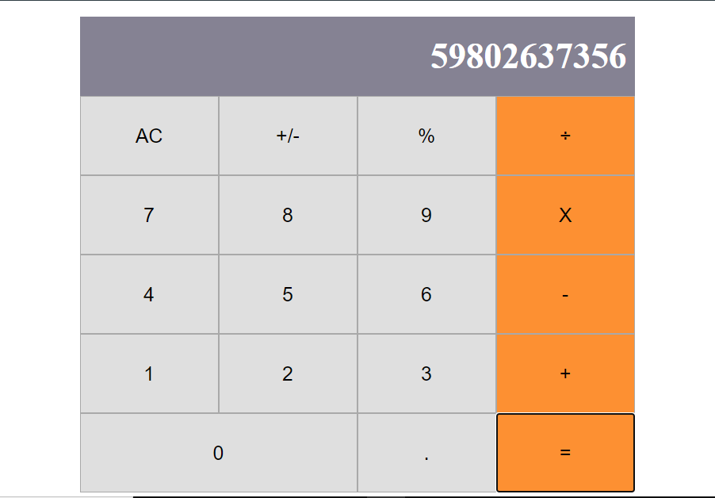

# React-Calculator

In this project:
- I Used React to build a calculator app.

This project was bootstrapped with [Create React App](https://github.com/facebook/create-react-app).

## What it does
- When the app is opened, you can make calculations, such as: sum, substraction, multiplication and division.

## live demo
[calculator link](https://evansinho-calculator.herokuapp.com/)

## Built with
- React
- HTML
- SCSS

### Prerequisites

- Node
- Npm

### Setup

- git clone `https://github.com/evansinho/calculator.git`
- cd calculator
- run npm install
- run npm run start

## Authors

👤 **Evanson Igiri**

- [Portfolio](https://evansinho.github.io/Evanson-igiri/)
- [Twitter](https://twitter.com/iamsinho1304)
- [Linkedin](LinkedIn.com/in/evanson-igiri)
- [Email](mailto:igiri.evanson@gmail.com)

## 🤝 Contributing

Contributions, issues and feature requests are welcome!

Feel free to check the [issues page](https://github.com/issues).

## Show your support

Give a ⭐️ if you like this project!## Live 
